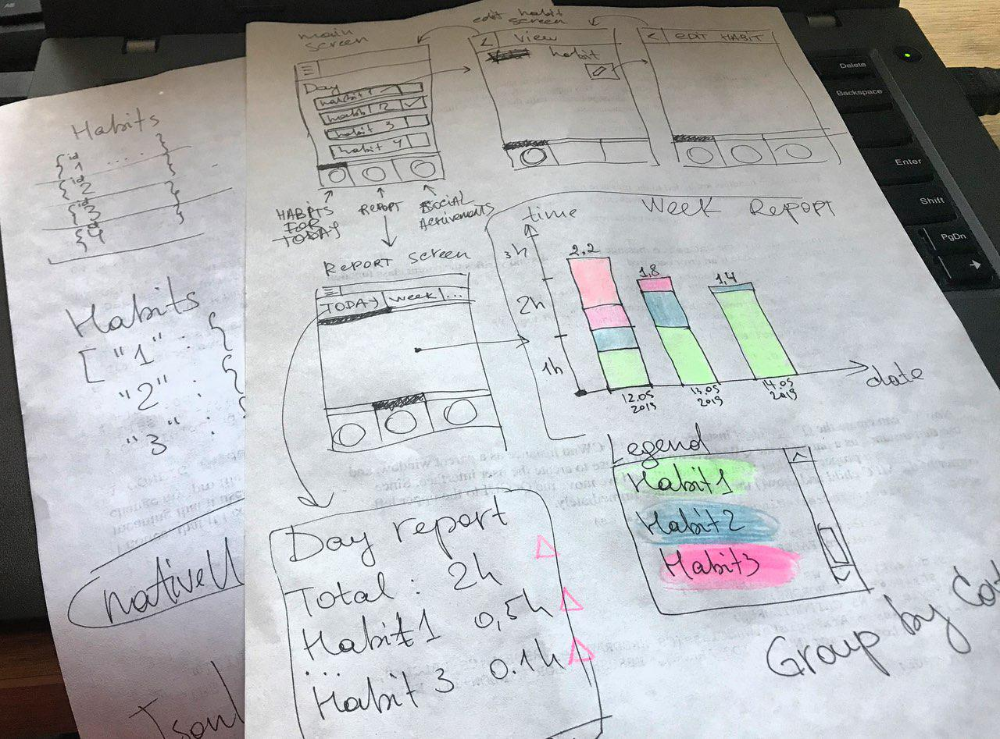

# There is a whole room for improvements

* Fancy visualization of spent time over habits:
  * Stacked bar charts for visualization.
  * Piechart to check what takes most of your time and what needs more improvements.
* Reports for given peroid:
  * Detailed daily report.
  * Weekly report.
  * Monthly report.
  * Custom periods.
* More detailed reports on spent time. May be any queries (day report, total, delta from planned, etc).
* Local notifications.
* FaceBook integration:
  * for ease of usage,
  * for social share,
  * for cloud storage,
  * for several device synchronization.
* Personal helper-advicer based on habits and records data.

