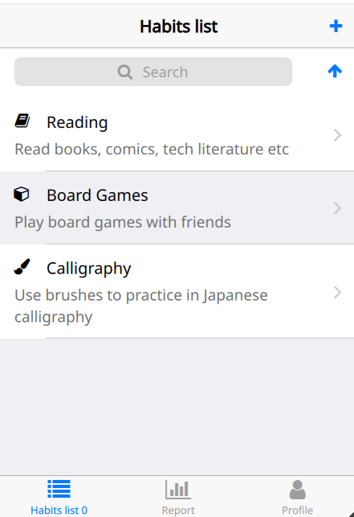
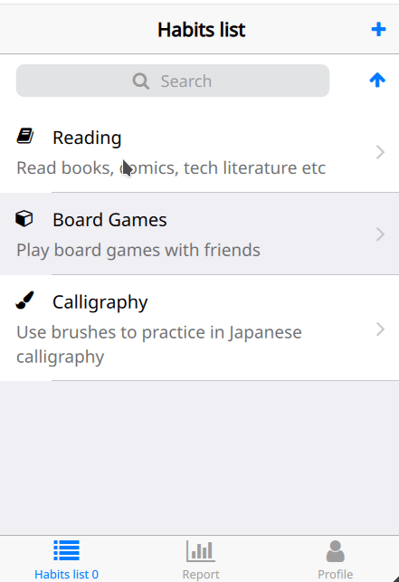

# How to make a GoodHabits application with Felgo

* [Project structure](#project-structure)
  * [Felgo Project Properties](#felgo-project-properties)
  * [Felgo Plugin Selection](#felgo-plugin-selection)
  * [Project management](#project-management)
* [Keeping all secrets](#keeping-all-secrets)
* [Keeping all application-wide constants together](#keeping-all-application-wide-constants-together)
* [Application](#application)
* [Navigation](#navigation)
* [Data structures](#data-structures)
  * [Habits data structure](#habits-data-structure)
  * [Feeding habits model](#feeding-habits-model)
  * [Records data structure](#records-data-structure)
  * [Feeding records model](#feeding-records-model)
  * [Generation of unique strings](#generation-of-unique-strings)
* [DataModel as data provider](#datamodel-as-data-provider)
  * [Logic as control for data](#logic-as-control-for-data)
  * [Data provider reaction on signals](#data-provider-reaction-on-signals)
  * [Connecting DataProvider to real models](#connecting-dataprovider-to-real-models)
* [View/edit habits](#viewedit-habits)
  * [HabitDetailPage](#habitdetailpage)
     * [Custom controls](#custom-controls)


---

This app helps people to understand how much time do they spend on their hobbies and interests, 
how sustainable their wishes and aims are and where the habit starts to benefit you in the new 
skills form. And the one effect we’re expecting is that being motivated to spend more time on 
good habits, you won’t spend time on bad habits...

So, basically it is advanced time tracker with categories mobile application (suitable for tablets 
too).




In this tutorial we will strip up basic things required for each mobile application like:

* stacked-page navigation,
* usage of layouts and preparation of adaptive UI,
* dealing with native dialogs,
* customizing controls,
* MVC:
  * model preparation,
  * view organization,
* loading and storing persistant data,
* oraganization of source code files,
* importing third party JS-modules.


# Project structure

We could start from creating basic Felgo application. To prepare basic project structure, use wizard in Felgo QtCreator:

New Project -> Felgo Apps -> Single-Page Application.

Provide name, choose correct folder to store your project to; choose Felgo Toolchain.

## Felgo Project Properties

As Felgo Project Properties provide:
* **App display name:** `GoodHabits`
* **App identifier:** provide your unique application identifier in format `com.yourcompany.GoodHabits`.
* **Interface orientation:** choose `Auto`, since we are going to use layouts and scroll areas to create adaptive UI for application.

## Felgo Plugin Selection

For this application no plugins required. No need to choose any.

## Project management

As a result wizard will create a list of files reqired for distributing application as on iOS same for Android:

```bash
/home/user/Projects/GoodHabits:

android/* [...]
assets/felgo-logo.png
ios/* [...]
macx/app_icon.icns
qml/Main.qml
qml/config.json
win/app_icon.ico
win/app_icon.rc
GoodHabits.pro
main.cpp
resources.qrc
```

That's great. We'll touch only few of them. Now we are ready to start programming.

# Keeping all secrets

As you may see, there is our main file `Main.qml` -- it will be our entry point to application.

You may see comment regarding license. In case you've already generated your license, this is great.
Let's avoid showing your license key in this `Main.qml` file. Create new directory `qml/secrets`. 
Put there 2 files:
 * `Secrets.qml` -- actual file that will be used in application. No one can see it. Let's agree that this will be file with sensitive data. Do not forget to add this file to your `.gitignore` file, so in case you are using git -- this very file will not get into remote repository.
 * `Secrets.qml_template` -- file that will not be used in applicatino, but will reflect secrets-file structure. This file could be uploaded to repositry without any problems.

 To be sure that secrets-component will be as lightweight as possible, we'll create it as singletone [`QtObject`](https://doc.qt.io/qt-5/qml-qtqml-qtobject.html):
```qml
pragma Singleton

import QtQuick 2.0

/**
 * This file intended to be secret and available only on build-machine.
 *   1. Rename License.qml_template -> License.qml.
 *   2. Insert your key into <KEY GOES HERE>.
 *   3. Add License.qml into .gitignore (if not added yet).
 */

QtObject {
    readonly property string key: "<KEY GOES HERE>"
}
```

# Keeping all application-wide constants together

Good practive is to keep all application-wide constants in one place. This should be lightweight singleton component (`components/Constants.qml`) 
that will contain information in next structure:

```qml
QtObject {
    // Constants used as field names
    readonly property string habitsDatabaseName: "GoodHabits"
 
    readonly property string hHabits: "habits"
    readonly property string hHabitID: "id"
    readonly property string hHabitTitle: "title"
    readonly property string hHabitDescription: "description"
    readonly property string hHabitIcon: "icon"
    readonly property string hHabitDuration: "duration"
    readonly property string hHabitTime: "time"
    // ...
}
```


# Application

You may see that newly created project already has [`App`] as a main component. The `App` type is used to create the top-level item in a new Felgo application. Every Felgo app begins with a single `App` component defined at the root of its hierarchy. We'll use its 

* properties:
  * [`tablet`] -- read-only property that is `true` if the screen's diameter is bigger than 6.7 inches. We'll use it to trigger a [`splitView`] in used [`NavigationStack`]s.
  * [`settings`] -- as persistent storage for key-value pairs of data, that are also available when the user closes the app and restarts it. This one we'll use for storing user defined settings.
* method [`dp()`] -- for density-independent measurements for pixel values. This will allow us to define the same physical size for elements across platforms and screens with different densities.


# Navigation

Newly created application already has [`NavigationStack`] with one [`Page`] already defined.

The [`NavigationStack`] item manages the navigation of hierarchical content represented by a stack of [`Pages`]. The [`NavigationStack`] component adds a navigation bar and is used to navigate between pages. The [`Page`] component is the container for a single page of content.

We'll have 3 different navigation stacks -- each for different purpose:

* **Habits** list -- to see a list of habits, see detailed information on habit, edit habits 
* **Report** -- to see a list of reported logged habits (called `records` in terms of application), see detailed information on records, edit records
* **Profile** -- see application information, access export/import page, access settings page.

You may understand that each of stacks is stand-alone, and could be navigatable by its own, to its own sub-pages.

We are going to create next hierarchical structure. Give this pages easy names that describes its content the best.

* Main page -- `Main.qml`
  * Habits
    * Page with a list of habits -- `HabitsListPage.qml`
    * View/Edit/Create habit page -- `HabitDetailPage.qml`
    * Create record on habit -- `RecordPage.qml`
  * Records
    * Report page with a list of records -- `ReportPage.qml`
    * Page to view/edit record -- `RecordPage.qml`
  * Profile
    * Page with general application info -- `ProfilePage.qml`
    * Export/Import application data -- `ImportExportPage.qml`
    * Page with settings -- `SettingsPage.qml`

Best approach is to reflect this structure in your source code folder structure. We'll create folder `qml/pages` where put all of mentioned pages. 

We'll implement page changing logic first. Create each page as simple and clean as possible with one item inside (couloured rectangle or centered text), e.g.:

```qml
Page {
    title: qsTr("Habits list")
    AppText {
    	text: qsTr("Habits list here")
    }
}
```

As soon as there are ready page components, lets get back to main component and prepare all required navigation stacks.
```qml
Navigation {
    id: navigation

    NavigationItem {
        title: qsTr("Habits list")
        icon: IconType.list

        NavigationStack {
            id: niHabitsList
            initialPage: HabitsListPage { }
        }
    }

    NavigationItem {
        title: qsTr("Report")
        icon: IconType.barchart

        NavigationStack {
            initialPage: ReportPage { }
        }
    }

    NavigationItem {
        title: qsTr("Profile")
        icon: IconType.user

        NavigationStack {
            initialPage: ProfilePage { }
        }
    }
}
```

As a result we'll have native look [`Navigation`] that will automatically use different navigation modes depending on the used platform. For iOS it will be tab bar with three icons on the bottom of the screen. 

We've set different icons for each tab (`icon`). Icon could be choosed from [`IconType`] -- a global object containing the possible `Icons`.

Each [`NavigationItem`] contains [`NavigationStack`] in it -- now our application could run and do some simple navigation between different stacks, each has one page inside.

Let's add possibility to navigate over pages inside stacks. Inside `HabitsListPage` create component:

```qml
Component {
    id: detailPageComponent
    HabitDetailPage { }
}
``` 

To load this page, add [`AppButton`] component into `HabitsListPage`:

```qml
AppButton {
    text: qsTr("Show Detail Page")
    onClicked: habitsListPage.navigationStack.popAllExceptFirstAndPush(detailPageComponent)
}
```

Code is self explanatory, on button click it will access `HabitsListPage`'s attached property [`navigationStack`] and pop every page inside stack except first and push page by its id `detailPageComponent`.

You may see that as soon as you get into `HabitDetailPage`, button `Back` appears on navigation bar. It will [`pop`] your current page and get you to previous page in stack.

Prepare rest of pages required for application, so we can do application navigation as it is expected. 


# Data structures 

Main task of application is to create and store information, so used data structures is vital question.

To simplify testing process and to get instant results, lets create file `qml/js/testData.js` and use it as data source for now. We could easily use [imported JavaScript resources in QML](https://doc.qt.io/qt-5/qtqml-javascript-imports.html).

## Habits data structure

Let's define all required fields for Habit structure. There should be:

* `id` as a unique identifier, key value,
* `title` -- name of habit,
* `description` -- optional detailed description of habit,
* `icon` -- text identifier of icon used for habit,
* `duration` -- float number that represents default amount of time  in hours spent on habit,
* `time` -- string that contains default time of the day that best suitable for habit,
* `days` -- string containing comma separated day values best suitable for habit.

Example of such predefined habit could be next one:
```js
"id": "g19yc4bd3vjumu3h2n",
"title": "Reading",
"description": "Read books, comics, tech literature etc",
"icon": "book",
"duration": "0.75",
"time": "09:00",
"days": "Mon,Tue,Wed",
```

Into `testData.js` we could put next variable:
```js
var habitsData = [
	{
	    "id": "g19yc4bd3vjumu3h2n",
	    "title": "Reading",
	    "description": "Read books, comics, tech literature etc",
	    "icon": "book",
	    "duration": "0.75",
	    "time": "09:00",
	    "days": "Mon,Tue,Wed",
	    "private": false,
	    "notifications": true
	},
	{
	    "id": "iiiuerpitpgjumu3xcg",
	    "title": "Board Games",
	    "description": "Play board games with friends",
	    "icon": "cube",
	    "duration": "2.5",
	    "time": "19:00",
	    "days": "Sun",
	    "private": false,
	    "notifications": true
	},
	{
	    "id": "r9we6s329jjumu41k4",
	    "title": "Calligraphy",
	    "description": "Use brushes to practice in Japanese calligraphy",
	    "icon": "paintbrush",
	    "duration": "1.0",
	    "time": "18:00",
	    "days": "Mon,Wed,Fri",
	    "private": false,
	    "notifications": true
	}
];
```
So, it will contain JSON array of objects of previously defined structure.


## Feeding habits model

Let's create [`AppListView`]  (`ListView` that provids native `ScrollIndicator`, an empty view and swipe gestures for its list delegates) in `HabitListPage` to show habits from `testData.js`.

```qml
AppListView {
    id: listView
    model: listModel

    delegate: SimpleRow {
        text: model.title
        detailText: model.description
        iconSource: IconType[model.icon]
        }
    }
}
```

As a `listModel` we'll use [`JsonListModel`] that is proxy view model for JSON data sources. Let's feed it ours test data, include respective file:
```js
import "../js/testData.js" as TestData
```
and use:
```qml
JsonListModel {
    id: listModel
    source: TestData.habitsData
    keyField: "id"
    fields: ["id", "title", "description", "icon", "duration", "time"]
}
```

Beeing right here we could extend view possibility by adding one more proxy [`SortFilterProxyModel`] in chain. We'll have this proxy chain:

Actual data from `testData.js` -> `JsonListModel` -> `SortFilterProxyModel` -> `AppListView` that will actually show sorted, filtered data using its delegate [`SimpleRow`].

`SortFilterProxyModel` will filter and sort our model. We'd like to have sorting of items by `title`. Also, it will be great to be able to filter habits by its title (in case if user has 10+ habits -- it is vital feature for quick access). Beforehand, create [`SearchBar`] component where user can input his search query. We'll use `RegExpFilter` for this purpose, because we want to get smarter strings matching approach. In case if input query is `car` we would like to get not only results that starts from `car`, but every else that contain `car` inside. To do it we use simple regular expression `.*` + our query.

```qml
SortFilterProxyModel {
    id: filteredModel
    sourceModel: listModel
    sorters: [
        StringSorter {
          roleName: "title"
          enabled: true
        }]
    filters: [
        RegExpFilter {
            roleName: "title"
            pattern: ".*" + searchBar.text
            enabled: searchBar.text != ""
            caseSensitivity: Qt.CaseInsensitive
        }]
}
```

## Records data structure

Records data structure is simpler than habits data structure. Each record will contain:

* `id` -- unique identifier of this record
* `date` -- date where the record was made
* `habit` -- identifier of habit
* `duration` -- float value, time spent on habit
* `time` -- string representation of time, when work on habit started.


```js
{
    "id": "123",
    "date": "2019-04-01",
    "habit": "g19yc4bd3vjumu3h2n",
    "duration": "0.75",
    "time": "09:00"
}
```

Let's populate `testData.js` file with JSON array of records.


## Feeding records model

Do the same at `ReportPage` as it was done for `HabitsListPage`: add same components: `JsonListModel`, `SortFilterProxyModel`, `AppListView` with `SimpleRow` delegate.

Main changes from Habits page are:
* We need to populate `jsonModel` with `DataModel.recordsData`. Key field is same called `id`, and fields that are interesting to us are `["id", "date", "habit", "duration", "time"]`.
* No need to apply any filters, just do sort by date.
* `AppListView` will contain section by property `date`, so all our records will be structured by date.

```qml
JsonListModel {
    id: jsonModel
    source: DataModel.recordsData
    keyField: "id"
    fields: ["id", "date", "habit", "duration", "time"]
}

// ...

SortFilterProxyModel {
    id: sortedModel
    // Note: when using JsonListModel, the sorters or filter might not be applied correctly when directly assigning sourceModel
    // use the Component.onCompleted handler instead to initialize SortFilterProxyModel
    Component.onCompleted: sourceModel = jsonModel
    sorters: StringSorter { id: typeSorter; roleName: "date"; ascendingOrder: false }
}

// ...

AppListView {
    id: listView
    model: sortedModel
    delegate: SimpleRow {
        text: model.habit
        detailText: model.time
        badgeValue: model.duration + "h"

	    section.property: "date"
	    section.delegate: SimpleSection {
	        textItem.font.bold: true
	    }
	}
}

```

Now you are able to view a list of habits and list of a records.


## Generation of unique strings

As for habit same for record object we use unique `id` identifier. It could be any identifier (even number), and we do not rely on order of that `id`s, we are not going to do sort on `id`. Problem with number as identifier is that if we need to generate new unique identifier we need to iterate over all of identifiers, and find the last one, then increment it.

To avoid this, we are going to use strings for `id`s and prepare `id` as random string based on random number and on time:
```js
/**
  * Function returns random id based on random and on time.
  * Simple and light implementation UUID.
  * @return type:string containing random uid.
  */
function generateId() {
    return Math.random().toString(36).substring(2) + (new Date()).getTime().toString(36);
}
```
Collision probability is quite low, but to be sure that we've got unique `id` we are going to iterate over all given `array` and check it, 
otherwise, we need to generate new `id`.

```js
/**
  * Function generate unique id using \c generateId. Then iterate over given \c array to ensure that generated
  * id is unique. If so, returns it, otherwise generate new and repeat procedure until generated id will be
  * unique.
  * @param type:var JSON-array of elements with attribute `id`.
  * @return type:string containing random unique (on \c array) uid.
  */
function getUniqueId(array) {
    var needToRegenerate = false
    do {
        var possibleUnique = generateId();
        for (var i = 0; i < array.length; ++i) {
            if (array[i].id == possibleUnique) {
                needToRegenerate = true;
                break;
            }
        }
    } while (needToRegenerate)
    return possibleUnique;
}
```


# `DataModel` as data provider

We'd like to work with real user-created data instad of predefined. For this purpose we are going to create
special component that will be hot plugged instead of our `TestData`.

It will encapsulate all related to loading, holding in memory, and storing of data (habits and records) and 
will have easy access to it via properties:

```qml
property alias records: // ...
property alias habits: // ...
```

As you may understand, we need to change `model` parameter of our `JsonListModels` to this ones.

Next properties will be used to access to particular, currently loaded habit or record:
```qml
property alias habitDetails: // ...
property alias recordDetails: // ...
```

Actual variables will be stored in so-called private section, inside component:
```qml
Item {
    id: _
    property var habits: []  // Array
    property var habitDetails: ({}) // Map
    property var records: [] // Array
    property var recordDetails: ({}) // Map
}
```

Storage and load will be done via [`Storage`] component. We define `databaseName` just to be sure that we didn't miss anything.

```qml
Storage {
    id: cache
    databaseName: Constants.habitsDatabaseName
}
``` 

## Logic as control for data

All data manipulation is supposed to be triggered via one entry-point component, called `Logic`.  This is signals-only component that trigers signals related to data manipulations. Signals-approach gives us flexibility. E.g.: in case we switch to WebStorage, logic will remain the same.
```qml
Item {
    signal loadHabits()
    signal loadRecords()

    signal importHabits(var habits)

    signal loadHabitDetails(string habitId)
    signal loadRecordDetails(string recordId)

    signal storeHabits()
    signal storeRecords()

    signal addEmptyHabit()
    signal addRecord(string habitId)

    signal removeHabit(string habitId)
    signal removeRecord(string recordId)
    signal clearCache()
}
```

Signals inside `Logic` are self explanatory. Since `Logic` component will be created inside `App` in `Main.qml`, it will be accessible from any point of application.


## Data provider reaction on signals

We'll take a look at all signals realted to habits. Almost the same will be related to records. Create `Connections` object inside `DataModel` and provide next connection events:

To load habits from previously stored:
```qml
onLoadHabits: {
    var cached = cache.getValue(Constants.hHabits)
    if (cached) {
        _.habits = cached
    } else {
        console.log("Can't find any")
        nativeUtils.displayMessageBox(qsTr("Can't find any cached habits!"),
                                      qsTr("Looks like you run this application for first time."), 1)
    }
}
```
Also this function could detect situation when there are no previously saved values available. This is situation when user starts application for first time. In this case we need to show respective dialog box. To do it, we have [`nativeUtils.displayMessageBox`] method that will display a native-looking message box dialog with a given title, an optional description that can provide more details, an OK button and an optional Cancel button.


To load habit details we'll use [JS find method](https://developer.mozilla.org/en-US/docs/Web/JavaScript/Reference/Global_Objects/Array/find):
```qml
onLoadHabitDetails: {
    _.habitDetails = _.habits.find(function(element){ return element.id === habitId })
}
```

`onStoreHabits` will trigger function`saveAndUpdateHabits()` that will store habits permanently and notify views by sending respective signals:
```js
function saveAndUpdateHabits() {
    cache.setValue(Constants.hHabits, _.habits)
    habitsChanged()
    habitDetailsChanged()
}
```

Add/remove habit are also quite self explanatory:
```qml
onAddEmptyHabit: {
    var draft = {
        id: getUniqueId(_.habits),
        // TODO: Add randomizer for habit names (tunable via settings)
        title: qsTr("My new habit..."),
        description: "",
        icon: "bed",
        duration: "1.0",
        time: "09:00",
        days: "Mon",
        private: false,
        notification: true,
    }
    _.habits.push(draft)
    saveAndUpdateHabits()
    _.habitDetails = draft
    habitStored(draft)
}

onRemoveHabit: {
    for (var i = _.habits.length - 1; i >= 0; --i) {
        if (_.habits[i].id == habitId) {
            _.habits.splice(i, 1)
        }
    }
    saveAndUpdateHabits()
    habitRemoved()
}
```

To remove habit from array of habits we use [JS splice method](https://developer.mozilla.org/en-US/docs/Web/JavaScript/Reference/Global_Objects/Array/splice).


## Connecting `DataProvider` to real models

To connect habits list model to actual list it is enough to change one line in `HabitsListPage`:

```qml
JsonListModel {
    id: listModel
    source: dataModel.habits // <--
``` 

# View/edit habits

We'll use the same page `HabitDetailPage` as for viewing, same for editing habit. The same idea will be used for records.

We need to get from list model item to new page regarding clicked item. It is easy to do. On `listView` of `HabitDetailPage` we need to put [`MouseArea`]:

```qml
MouseArea {
    anchors.fill: parent
    onClicked: {
        logic.loadHabitDetails(model.id)
        page.navigationStack.popAllExceptFirstAndPush(detailPageComponent,
                                                      { habitId: model.id })
        mouse.accepted = true
    }
}
```

On click we should ask to load habit details with given `id` and push `detailPageComponent` with option that points to habit `id` currently loaded.

## `HabitDetailPage`

This is tricky page, since it will have right bar navigation item inside to reflect if this page is currently locked (locked -- for view only, unlocked for edit).

```qml
rightBarItem: NavigationBarRow {
    // edit habit
    IconButtonBarItem {
        icon: habitDetailPage.locked ? IconType.lock : IconType.unlock
        showItem: showItemAlways
        onClicked: toggleLocked()
    }
}
```

And function `toggleLocked()` will trigger `saveAll()` function in case if user came to locked state from unlocked, to save all values into `currentHabit`, and obviously, store them:

```js
function saveAll() {
    currentHabit[Constants.hHabitTitle] = habitTitleText.text
    currentHabit[Constants.hHabitDescription] = habitDescriptionText.text
    currentHabit[Constants.hHabitDuration] = habitDurationSlider.value
    currentHabit[Constants.hHabitTime] = habitTypicalTime.text
    currentHabit[Constants.hHabitIcon] = habitIconButton.iconName
    currentHabit[Constants.hHabitDays] = daysPicker.getDays()
    logic.storeHabits()
}
```

Here, we access to each fields by names defined in `Constants`, since it is very useful -- to define it one time and use it anywhere.


## Custom controls

Among default controls required for `HabitDetailPage` there are custom ones, like:

* `WarningPaper`
* `GHTextInputTime`
* `DaysPicker`
* `IconPicker` "dialog"


### `WarningPaper`

This is Simple AppPaper override for any in-place message boxes. Appearance and dissappearance of this box will be animated.

Animation of this component is done via usage of [States](https://doc.qt.io/qt-5/qml-qtquick-state.html) & [Behavior](https://doc.qt.io/qt-5/qml-qtquick-behavior.html):

```qml
    states: [
        State {
            name: "invisible"
            when: !needShow
            PropertyChanges { target: editNote; Layout.preferredHeight: 0 }
        },
        State {
            name: "visible"
            when: needShow
            PropertyChanges { target: editNote; Layout.preferredHeight: appText.implicitHeight }
        }
    ]

    Behavior on Layout.preferredHeight { NumberAnimation { duration: Constants.animationDuration } }
```

Idea is simple -- we have two states with different `Layout.preferredHeight` values. `Behavior` animates this property change.


### `GHTextInputTime`

This is simple [`AppTextInput`] with predefined  `placeholderText` (as `00:00`) and with applied RegExp validator to filter only time in 24H format.

```qml
AppTextInput {
    id: editTime
    text: "09:00"
    placeholderText: "00:00"
    validator: RegExpValidator {
        regExp: /^(0[0-9]|1[0-9]|2[0-3]|[0-9]):[0-5][0-9]$/
    }
}
```


### `DaysPicker`

This is [`Grid`]-based component that has [`AppCheckBox`]es for each day in week. Days could be set via string, and get in a string representation.

```js
/**
  * Function returns joined string of checked ckeckboxes that represents days.
  * @return type:string containing joined string.
  */
function getDays() {
    var result = ""
    result += habitDayMonday.checked    ? dayMonday    + "," : ""
    result += habitDayTuesday.checked   ? dayTuesday   + "," : ""
    result += habitDayWednesday.checked ? dayWednesday + "," : ""
    result += habitDayThursday.checked  ? dayThursday  + "," : ""
    result += habitDayFriday.checked    ? dayFriday    + "," : ""
    result += habitDaySaturday.checked  ? daySaturday  + "," : ""
    result += habitDaySunday.checked    ? daySunday    + "," : ""
    return result
}
```

```js
    function setDays(fromString) {
        uncheckAll()
        if (fromString == "") {
            console.log("No days specified")
            return
        }

        var days = fromString.split(",")
        if (days.length > 7) {
            console.warn("Something strange happenning")
        }
        for (var i = 0; i < days.length; ++i) {
            switch (days[i]) {
            case dayMonday: habitDayMonday.checked = true; break;
            case dayTuesday: habitDayTuesday.checked = true; break;
            case dayWednesday: habitDayWednesday.checked = true; break;
            case dayThursday: habitDayThursday.checked = true; break;
            case dayFriday: habitDayFriday.checked = true; break;
            case daySaturday: habitDaySaturday.checked = true; break;
            case daySunday : habitDaySunday .checked = true; break;
            }
        }
    }
``` 

Not so elegant implementation, but stable working.


### `IconPicker` "dialog" and `IconTypeHelper`

This is component as a [`Rectangle`] for choosing icon from a grid of available icons. To make it possible to implement such component we need to find a way to store icon names of [`IconType`]. So we provide `IconTypeHelper` as a singleton type with a lost of all possible icons in [`IconType`].

```js
readonly property var iconsModel: ListModel {
    id: list
    Component.onCompleted: {
        for (var i = 0; i < IconTypeHelper.iconsList.length; ++i) {
            const current = IconTypeHelper.iconsList[i]
            const pair = { iconText: current, iconUtf: IconType[current] }
            list.append( pair )
        }
    }
}

/// List of available icons in `IconType` for Felgo 3.0.
readonly property var iconsList: [
    "adjust",
    "adn",
    "aligncenter",
    "alignjustify",
    ...
    ]
```

So we have a list of available icons and can iterate over it to populate grid with icons. We create [`GridView`] and populate it with 
filtered in [`SortFilterProxyModel`] model:

```qml
GridView {
    id: grid
    delegate: Item {
        id: delegate
        width: grid.cellWidth
        height: grid.cellHeight
        Column {
            anchors.fill: parent
            IconButton {
                icon: iconUtf
                anchors.horizontalCenter: parent.horizontalCenter
                onClicked: iconChoosed(iconText, iconUtf)
            }
            AppText {
                text: iconText
                width: delegate.width - dp(Constants.defaultSpacing)
                elide: Text.ElideRight
                horizontalAlignment: Text.AlignHCenter
            }
        }
    }
    model: filteredModel
}
```
`SortFilterProxyModel` used here with same idea as in `HabitsListPage` -- to give user ability to filter icons by its names.

In `GridView`s `delegate` we show [`IconButton`] with respective `icon`, and [`AppText`] with hicon name.

As soon as user chooses icon component will emit signal `signal iconChoosed(string iconName, string iconUtf)`.


## Advanced features

### Usage of JSONPath

We've added [`jsonpath.js`](https://github.com/kromain/qml-utils/blob/master/JSONListModel/jsonpath.js) to source code, so it could be accessible via
```js
import "../js/jsonpath.js" as JP
```

[JSONPath for JSON is like XPath for XML.](https://www.baeldung.com/guide-to-jayway-jsonpath)

It gives us possibility to get easier access to JS objects. E.g., we have this helper function that returns habit by given id:

```js
    function getHabitById(uid) {
        // TODO: add checks
        var jpath = "$[?(@.id=='" + uid + "')]";
        var result = JP.jsonPath(dataModel.habits, jpath)
        if (result == false) {
            return ""
        } else {
            return result[0]
        }
    }
```

and respective wrapper over it to get habit `title` by given `id`:

```js
function getHabitTitleById(uid) {
    if (uid == "")
        return ""
    var h = getHabitById(uid)
    if (h == false) return ""
    return h.title
}
```

This function could be used in `ReportPage` to get information on linked habits on partivular records.


---
[`App`]: https://felgo.com/doc/felgo-app
[`AppButton`]: https://felgo.com/doc/felgo-appbutton
[`AppCheckbox`]: https://felgo.com/doc/felgo-appcheckbox
[`AppListView`]: https://felgo.com/doc/felgo-applistview
[`AppText`]: https://felgo.com/doc/felgo-apptext
[`AppTextInput`]: https://felgo.com/doc/felgo-apptextinput
[`dp()`]: https://felgo.com/doc/felgo-app/#dp-method
[`Grid`]: https://doc.qt.io/qt-5/qml-qtquick-grid.html
[`GridView`]: https://doc.qt.io/qt-5/qml-qtquick-gridview.html
[`IconButton`]: https://felgo.com/doc/felgo-iconbutton
[`IconType`]: https://felgo.com/doc/felgo-icontype/
[`JsonListModel`]: https://felgo.com/doc/felgo-jsonlistmodel
[`MouseArea`]: https://doc.qt.io/qt-5/qml-qtquick-mousearea.html
[`nativeUtils.displayMessageBox`]: https://felgo.com/doc/felgo-nativeutils/#displayMessageBox-method
[`Navigation`]: https://felgo.com/doc/felgo-navigation/
[`NavigationItem`]: https://felgo.com/doc/felgo-navigationitem
[`NavigationStack`]: https://felgo.com/doc/felgo-navigationstack/
[`navigationStack`]: https://felgo.com/doc/felgo-page/#navigationStack-prop
[`Page`]: https://felgo.com/doc/felgo-page
[`pop`]: https://felgo.com/doc/felgo-navigationstack/#pop-method
[`Rectangle`]: https://doc.qt.io/qt-5/qml-qtquick-rectangle.html
[`SearchBar`]: https://felgo.com/doc/felgo-searchbar
[`settings`]: https://felgo.com/doc/felgo-app/#settings-prop
[`SimpleRow`]: https://felgo.com/doc/felgo-simplerow
[`SortFilterProxyModel`]: https://felgo.com/doc/felgo-sortfilterproxymodel
[`splitView`]: https://felgo.com/doc/felgo-navigationstack/#splitView-prop
[`tablet`]: https://felgo.com/doc/felgo-app/#tablet-prop
